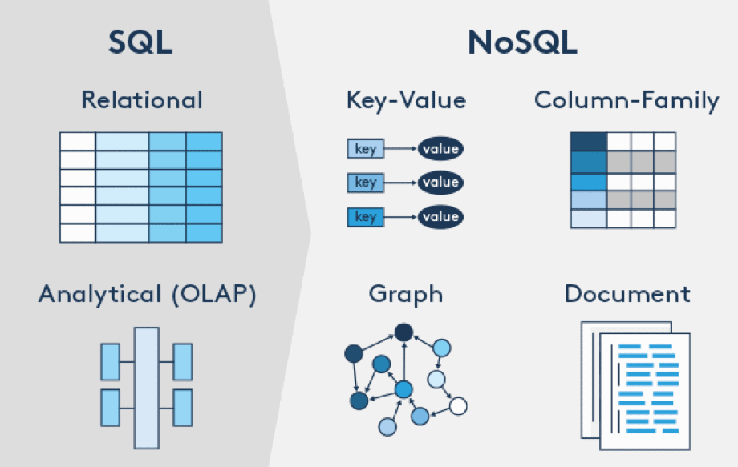
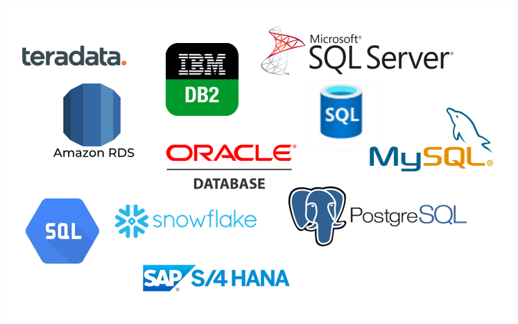
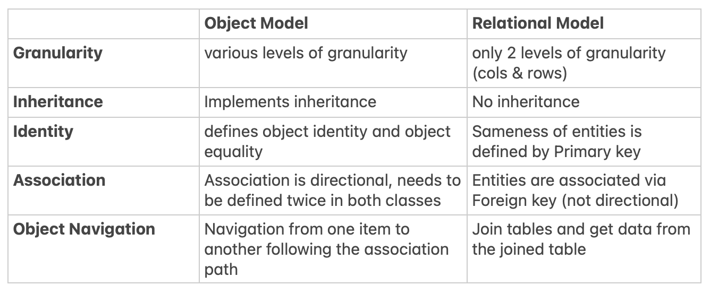
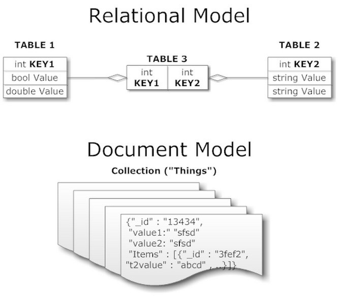
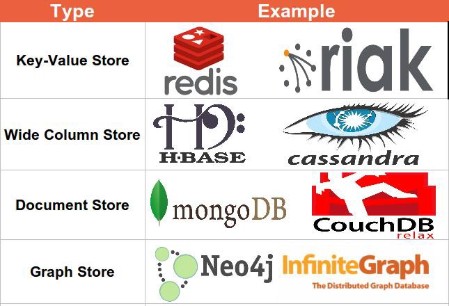
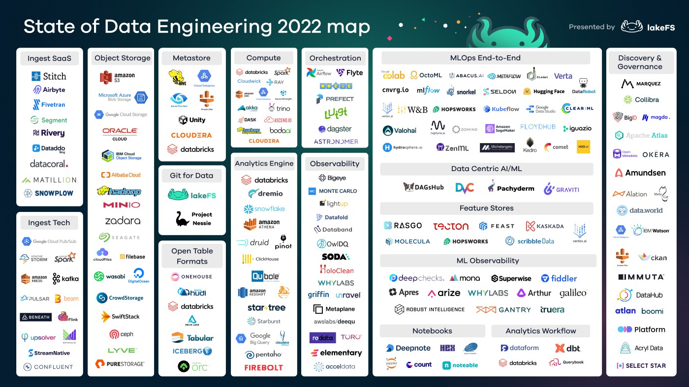

# Medium Articles of interest

---

## [Data Science Bookmarks](https://towardsdatascience.com/top-5-bookmarks-every-data-analyst-should-have-547a2c9ad1fe)

- [Ascii Table Formatter](https://ozh.github.io/ascii-tables/)
- [SQL Beautifier](https://codebeautify.org/sqlformatter)
- [JSON Converter](https://www.convertcsv.com/csv-to-json.htm)
- [JSON Viewer](http://jsonviewer.stack.hu/)
- [Graph builder](https://app.rawgraphs.io/)
- [SQL Generator](https://app.rasgoml.com/sql)
- [RegEx Helper](https://regexr.com/)
- [Additional RegEx](https://regex101.com/)

---

## [Summer 2022 recommended reading from MIT](https://medium.com/open-learning/summer-2022-recommended-reading-from-mit-2967dad6fbf0)

- [“Computational Thinking Education in K-12: Artificial Intelligence Literacy and Physical Computing”](https://mitpress.mit.edu/books/computational-thinking-education-k-12)
- [Journeys Through the Radiant Citadel](https://dnd.wizards.com/products/journeys-through-radiant-citadel)
- [“97 Things Every Data Engineer Should Know: Collective Wisdom from the Experts”](https://www.oreilly.com/library/view/97-things-every/9781492062400/)
- [“Learning Engineering Toolkit: Evidence-Based Practices from the Learning Sciences, Instructional Design, and Beyond” ](https://www.routledge.com/Learning-Engineering-Toolkit-Evidence-Based-Practices-from-the-Learning/Goodell-Kolodner/p/book/9781032232829)
- [Fearless: A Dissection of Jamaican Spirituality: A Path to Unity and Triumph for the African and Non-African Diaspora](https://www.amazon.com/Fearless-Dissection-Jamaican-Spirituality-Non-African/dp/B09DMXTLHM)

---

## [Introducing Tabpy: Tableau + Python](https://medium.datadriveninvestor.com/introducing-tabpy-tableau-python-e812bf3f2632)

> *TabPy (the Tableau Python Server) is an Analytics Extension implementation that expands Tableau’s capabilities by allowing users to execute Python scripts and saved functions via Tableau’s table calculations.*

- Some benefits are:
  - Advanced Analytics
  - Machine Learning ready dashboards
  - Advanced Calculations
  - Effective Exploratory Data Analysis

### Installation

- The GitHub repository of TabPy can be cloned and used directly
- other way is using pip or conda.
- TabPy is compatible with Python 3.6 and above.

`pip install tabpy`

### Using Tabpy

- After installation from CLI run the command “tabpy” to connect to the server.

- Now Tabpy server is up for use. We can now connect with tabpy in tableau in Help -> Settings and Performance -> Manage External Service Connection.

- There are two ways that we can use to do Python calculation:
  - Write code directly as Tableau calculated fields. The code then will be immediately executed on the fly in the TabPy server.
  - Deploy a function into the TabPy server that can be reachable as a REST API endpoint.

- Now Tableau is ready to be used with python computation as it is linked with Tabpy. Now it is ready to perform operations on data with Python script.

### Conclusion

You have now successfully integrated Python with Tableau. Next, you can connect to your data and use it for visualization and advanced analytics, storytelling, interactive graphs etc. with TabPy. This integration is a beginning step for a more advanced use case using Tableau and Python.

---

## [Time Series Analysis- Everything you need to know!!!](https://faun.pub/time-series-analysis-everything-you-need-to-know-70578321085e)

---

## [How To Build Better Regression Models](https://heartbeat.comet.ml/how-to-build-better-regression-models-bce90890b7fb)

---

## [Data Engineering Explained: Data Models](https://medium.com/geekculture/data-engineering-explained-data-models-d69770a35d39)

- The domination of the relational model has lasted around 25 years for the numerous advantages it offers :
  - Relational model hides implementation detail behind a clean interface, which results into a simple code.
  - SQL query language is declarative, you tell it what data you want, on which condition to filter and how (required processing) you want it and the query optimizer takes care of delivering results to you.
  - Good support for joins and complex queries.
  - Better at handling many-to-many and many-to-one relationships (Normalization, and support for joins allow to de-duplicate data, enforce style and spelling consistency, ease of updating denormalized data, tables are narrower …)

- Drawbacks
  - **Object relational mismatch**: There is an awkward translation layer between objects in the application code and the data layer when compared to other data models (e.g. document model). If we take the example of Java which implements the Object Model (vs relational model), here are the main instances of paradigm (or impedance) mismatch

- Advantages
  - Schemaless: When you are a young startup and when your data is still evolving and has no flexible schema, document model is your best ally. The term schemaless is misleading since, at some point of your code, you have assumptions on some kind of your structure held by your data. Actually, there is a schema that is implicit (not enforced by the database) schema-on-read is a more accurate term (as opposed to on-write-schema in relational model). We can see the difference between the two approaches in situations where the application updates its data format:
    - **Document Databases:** Start writing new docs with the new fields, handle old documents in your application code.
    - **Relational Databases**: Run an ALTER TABLE + UPDATE queries. These operations are likely to be slow and cause the database to have an important downtime
  - **Data locality**: Documents are stored as single continuous strings (encoded as JSON or XML etc …), your database loads the entire document whenever you need it. Since the whole document is loaded each time it’s queried, a best practice is to keep documents concise and small in size. This feature comes in handy if your application needs the entire document (for example to render it on a web page), one query is sufficient. In contrast, the relational model requires you to perform multiple queries (query each table) or perform a complex multi-way joint between many tables to have all the relevant information.
  - Greater scalability: While document databases allow for horizontal scaling, traditional SQL databases can’t typically scale horizontally for write operations by adding more servers, (this is possible for read operations by adding read-only replicas).
  - **Dynamic and expressive data model**: The document model is closer to the data structure used by some applications, this prevents the impedance mismatch and yields a cleaner and simpler code. Moreover, the document model is good as representing one-to-many relationships.

- Drawbacks
  - **Data locality (again)**: Locality can become problematic if only a small portion of the document is needed. The database will keep loading the document as a whole even when it is unnecessary. Changing fields within a document rewrites the whole document as well. An exception is made for changes that do not affect the encoded size of the document.
  - **Weak support for joins**: Joins can be emulated in application code by making multiple queries to the database. This is an anti-pattern for two reasons: It is not computationally efficient and moreover, it shifts the work of making joins from the database to the application code (unnecessary complexity).
  - nos When apps get complex data gets interconnected, and many-to-one / many-to-many relationships might be needed. Document Model becomes less interesting in those cases.

### Top Technologies that implement the Document Model

### The Graph-like Model

- From what we saw so far:
  - When your app has mostly one-to-many relationships (tree-structured data) or no relationships, then the document model is your best ally.
  - When you are required to enforce schema on write / your data has strong and complex relationships (many-to-one, many-to-many) that document model cannot represent well, then go for SQL.
- Taking things to the extreme, what if many-to-many relationships are VERY common and that anything in your data can potentially be related to everything ? In that case, it becomes natural to start modeling your data as a graph.

- Graphs consist of two kinds of elements:
  - vertices: also known as nodes or entities
  - edges: also known as relationships or arcs

- Example of data that can be modeled as graphs include: Social Media Data (people are vertices, and edges indicate which people are connected), Web graph (web pages are vertices, and edges indicate HTML links between pages) …

- Many algorithms can operate on this kind of Data (e.g.)
  - Dijkstra (shortest path) between two points in a road network
  - PageRank for web graph
  - Graphs need not to have homogenous data. They are actually a powerful way of storing completely different types of objects in a single store. See example below:

- Advantages
  - Schema flexibility, closer to the object model used in application code.
  - Models many-to-many relationships very well
  - Optimal if we need to navigate through vertices / entities (we can leverage famous and well-known Graph Optimization Algorithms)
- Drawbacks
  - Not suited for data that is not highly interconnected. Even though each data model can be emulated by any data model, the result is often awkward and unnatural.

Top Technologies that implement Graph-like Models

## Conclusion2

- There is no one-size-fits-all solution:
  - Use document databases for use cases where data comes in self-contained documents and relationships between one document and another are rare.
  - Graph databases go in the opposite direction targeting use cases where anything is potentially related to everything
  - Relational model is here to stay. It is highly used for Analytical workloads and still used for transactional workloads where a schema needs to be enforced on write.

---

## [The State of Data Engineering 2022](https://medium.com/whispering-data/the-state-of-data-engineering-2022-d6ef0f7cf607)

---
